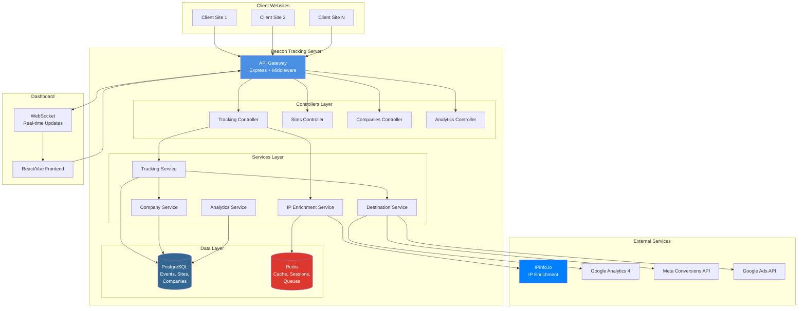
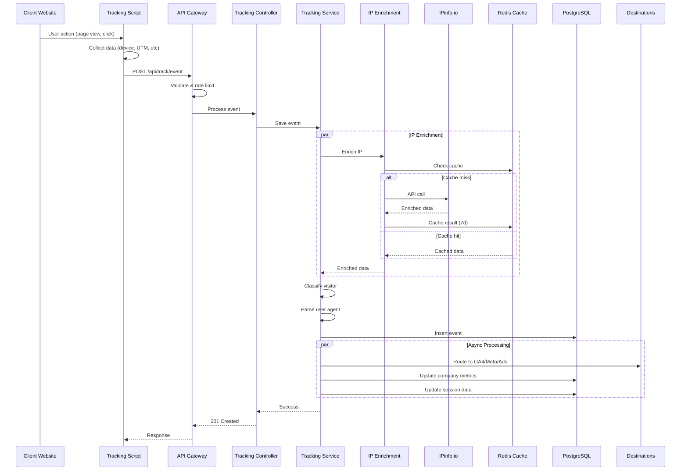
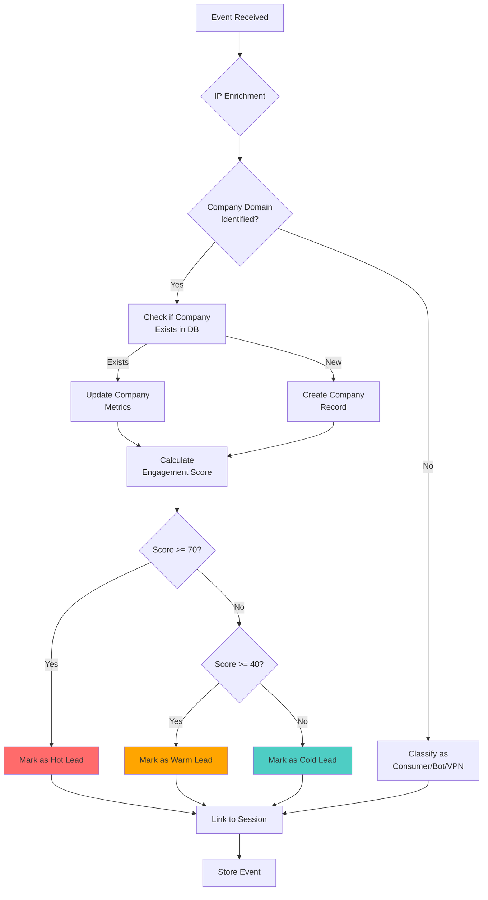
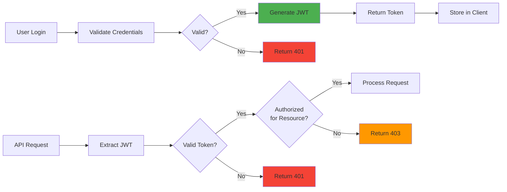

# Beacon System Architecture

**Version:** 1.0.0  
**Last Updated:** November 7, 2025  
**Author:** Hype Insight Development Team

---

## Table of Contents

1. [Overview](#overview)
2. [System Architecture Diagram](#system-architecture-diagram)
3. [Component Architecture](#component-architecture)
4. [Data Flow](#data-flow)
5. [Technology Stack](#technology-stack)
6. [Scalability Considerations](#scalability-considerations)
7. [Security Architecture](#security-architecture)

---

## Overview

Beacon is a script-based, server-side tracking solution designed to restore up to 76% of hidden user behavior by bypassing browser privacy restrictions. The system follows a modern, scalable architecture with clear separation of concerns.

### Design Principles

1. **Server-Side First**: All critical processing happens on the server to bypass client-side restrictions
2. **Multi-Tenant**: Full isolation between agencies and their clients
3. **Privacy-Compliant**: GDPR and CCPA compliant by design
4. **High Performance**: Redis caching and optimized database queries
5. **Extensible**: Plugin architecture for destination platforms

---

## System Architecture Diagram

---

## Component Architecture

### 1. API Gateway Layer

**Purpose**: Entry point for all requests, handles authentication, rate limiting, and routing.

**Components**:
- Express.js server
- Security middleware (Helmet, CORS)
- Rate limiting
- Request validation
- Error handling

**Key Files**:
- `src/server.js` - Main server setup
- `src/middleware/errorHandler.js` - Error handling
- `src/middleware/validation.js` - Request validation

### 2. Controllers Layer

**Purpose**: Handle HTTP requests and responses, orchestrate service calls.

**Components**:
- **Tracking Controller**: Event ingestion and processing
- **Sites Controller**: Site management (CRUD)
- **Companies Controller**: B2B visitor insights
- **Analytics Controller**: Metrics and reports
- **Auth Controller**: Authentication and authorization

**Key Files**:
- `src/controllers/trackingController.js`
- `src/controllers/sitesController.js` (to be implemented)
- `src/controllers/companiesController.js` (to be implemented)

### 3. Services Layer

**Purpose**: Business logic and data processing.

**Components**:

#### Tracking Service
- Event validation and enrichment
- Deduplication
- Database persistence
- Queue management

#### IP Enrichment Service
- IPinfo.io API integration
- Smart caching (7d business, 24h consumer, 6h VPN)
- Visitor classification
- Cache statistics

#### Company Service
- Company identification and creation
- Engagement scoring
- Lead classification (hot/warm/cold)
- Visit history tracking

#### Analytics Service
- Metrics calculation
- Report generation
- Data aggregation
- Funnel analysis

#### Destination Service
- Event routing to platforms (GA4, Meta, Google Ads)
- Format transformation
- Delivery tracking
- Retry logic

**Key Files**:
- `src/services/trackingService.js`
- `src/services/ipEnrichmentService.js` ✅
- `src/services/companyService.js` (to be implemented)
- `src/services/analyticsService.js` (to be implemented)

### 4. Data Layer

#### PostgreSQL
**Purpose**: Primary data store for events, sites, companies, sessions.

**Tables**:
- `agencies` - Multi-tenant organizations
- `sites` - Client websites
- `events` - Tracking events (65 data points)
- `companies` - B2B visitor identification
- `sessions` - Session tracking
- `dashboard_users` - User management

**Key Features**:
- JSONB for flexible data
- Optimized indexes
- Materialized views for analytics
- ACID compliance

#### Redis
**Purpose**: Caching, session management, job queues.

**Use Cases**:
- IP enrichment cache (7d TTL for business)
- Session storage
- Real-time counters
- Event queue (Bull/BullMQ)
- Dashboard metrics cache (30-60s)

---

## Data Flow

### Event Tracking Flow

### Company Identification Flow

---

## Technology Stack

### Backend
- **Runtime**: Node.js 18+
- **Framework**: Express.js 4.x
- **Language**: JavaScript (ES6+)

### Databases
- **Primary DB**: PostgreSQL 13+
- **Cache/Queue**: Redis 6+
- **Analytics (Optional)**: ClickHouse

### External APIs
- **IP Enrichment**: IPinfo.io
- **Destinations**: GA4, Meta Conversions API, Google Ads API

### Frontend (Future)
- **Framework**: React 18+ or Vue.js 3+
- **UI Library**: Tailwind CSS + shadcn/ui
- **Charts**: Recharts or Chart.js
- **Real-time**: Socket.io

### DevOps
- **Version Control**: Git
- **CI/CD**: GitHub Actions / GitLab CI
- **Monitoring**: Sentry (errors), Datadog/Grafana (metrics)
- **Deployment**: Docker, Kubernetes (future)

---

## Scalability Considerations

### Horizontal Scaling

**API Servers**:
- Stateless design allows multiple instances
- Load balancer distributes traffic
- Session stored in Redis (shared state)

**Database**:
- Read replicas for analytics queries
- Connection pooling (10 connections per instance)
- Partitioning events table by date

**Redis**:
- Redis Cluster for high availability
- Separate instances for cache vs queue

### Vertical Scaling

**Optimization Strategies**:
- Database indexes on frequently queried columns
- Materialized views for complex analytics
- Query result caching (30-60s TTL)
- Event batching (reduce DB writes)

### Performance Targets

| Metric | Target | Notes |
|--------|--------|-------|
| API Response Time (P95) | < 200ms | Event ingestion |
| IP Enrichment | < 30ms | With cache hit |
| Database Query | < 50ms | With proper indexes |
| Event Processing | < 500ms | End-to-end |
| Cache Hit Rate | > 80% | IP enrichment |
| Throughput | 1000 events/sec | Single instance |

---

## Security Architecture

### Authentication & Authorization

### Data Security

**In Transit**:
- TLS 1.3 for all connections
- HTTPS only (no HTTP)
- Certificate pinning for mobile apps

**At Rest**:
- PostgreSQL encryption
- Redis AUTH password
- Hashed PII (SHA-256)

**API Security**:
- Rate limiting (100 req/15min per IP)
- Request validation (express-validator)
- CORS whitelist
- Helmet.js security headers
- XSS protection
- CSRF protection

### Privacy Compliance

**GDPR**:
- Consent management
- Right to access
- Right to deletion
- Data minimization
- 90-day retention policy

**CCPA**:
- Privacy policy disclosure
- Opt-out mechanism
- No data selling

---

## Related Documentation

- [Database Schema](../database/schema.md)
- [API Specification](../api/openapi.yaml)
- [Deployment Guide](../guides/deployment.md)
- [ADR: Why IPinfo.io](../adr/001-ip-enrichment-service.md)

---

**Document Version**: 1.0.0  
**Next Review**: January 2026
