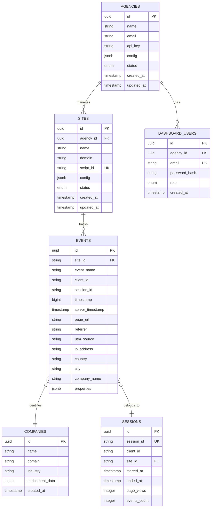

# Beacon Database Schema Documentation

Complete documentation of the Beacon PostgreSQL database schema with entity relationships, indexes, and query patterns.

## Table of Contents

- [Overview](#overview)
- [Entity Relationship Diagram](#entity-relationship-diagram)
- [Tables](#tables)
  - [agencies](#agencies)
  - [sites](#sites)
  - [events](#events)
  - [companies](#companies)
  - [sessions](#sessions)
  - [dashboard_users](#dashboard_users)
- [Indexes](#indexes)
- [Sample Queries](#sample-queries)

---

## Overview

Beacon uses PostgreSQL as its primary database for storing tracking events, site configurations, and agency data. The schema is designed for:

- **High write throughput** (events table optimized for inserts)
- **Multi-tenancy** (agency isolation)
- **Fast analytics queries** (strategic indexes)
- **Data retention** (partitioning ready)

**Total data points tracked:** 65+ fields per event

---

## Entity Relationship Diagram



---

## Tables

### agencies

**Purpose:** Multi-tenant isolation - each agency can manage multiple client sites.

| Column | Type | Constraints | Description |
|--------|------|-------------|-------------|
| id | UUID | PRIMARY KEY | Unique agency identifier |
| name | VARCHAR(255) | NOT NULL | Agency name |
| email | VARCHAR(255) | UNIQUE | Contact email |
| api_key | VARCHAR(255) | NOT NULL | Hashed API key (bcrypt) |
| config | JSONB | DEFAULT '{}' | Agency configuration |
| status | VARCHAR(20) | DEFAULT 'active' | active, suspended, deleted |
| created_at | TIMESTAMP | DEFAULT NOW() | Creation timestamp |
| updated_at | TIMESTAMP | DEFAULT NOW() | Last update timestamp |

**Relationships:**
- One agency has many sites
- One agency has many dashboard users

**Indexes:**
```sql
CREATE INDEX idx_agencies_status ON agencies(status);
CREATE INDEX idx_agencies_email ON agencies(email);
```

---

### sites

**Purpose:** Client websites being tracked. Each site gets a unique script_id for tracking.

| Column | Type | Constraints | Description |
|--------|------|-------------|-------------|
| id | UUID | PRIMARY KEY | Unique site identifier |
| agency_id | UUID | FOREIGN KEY | References agencies(id) |
| name | VARCHAR(255) | NOT NULL | Site display name |
| domain | VARCHAR(255) | NOT NULL | Site domain (example.com) |
| script_id | VARCHAR(50) | UNIQUE, NOT NULL | Tracking script identifier |
| config | JSONB | DEFAULT '{}' | Site-specific configuration |
| status | VARCHAR(20) | DEFAULT 'active' | active, paused, deleted |
| created_at | TIMESTAMP | DEFAULT NOW() | Creation timestamp |
| updated_at | TIMESTAMP | DEFAULT NOW() | Last update timestamp |

**Relationships:**
- Many sites belong to one agency
- One site has many events

**Indexes:**
```sql
CREATE UNIQUE INDEX idx_sites_script_id ON sites(script_id);
CREATE INDEX idx_sites_agency_id ON sites(agency_id);
CREATE INDEX idx_sites_status ON sites(status);
CREATE INDEX idx_sites_domain ON sites(domain);
```

---

### events

**Purpose:** Core tracking table storing all user events with 65+ data points.

#### Event Metadata
| Column | Type | Description |
|--------|------|-------------|
| id | UUID | PRIMARY KEY - Unique event identifier |
| site_id | VARCHAR(50) | References sites.script_id |
| event_id | VARCHAR(100) | Client-generated event ID |
| event_name | VARCHAR(100) | Event type (page_view, click, etc.) |
| timestamp | BIGINT | Client-side timestamp (milliseconds) |
| server_timestamp | TIMESTAMP | Server-side timestamp (authoritative) |

#### User Identification (6 fields)
| Column | Type | Description |
|--------|------|-------------|
| client_id | VARCHAR(100) | Persistent user identifier (2yr cookie) |
| session_id | VARCHAR(100) | Session identifier (30min timeout) |
| session_number | INTEGER | Sequential session count for user |
| user_id | VARCHAR(100) | Authenticated user ID (if available) |
| email_hash | VARCHAR(64) | SHA-256 hashed email |
| phone_hash | VARCHAR(64) | SHA-256 hashed phone |

#### Device & Browser (10 fields)
| Column | Type | Description |
|--------|------|-------------|
| user_agent | TEXT | Full user agent string |
| device_type | VARCHAR(20) | desktop, mobile, tablet |
| device_brand | VARCHAR(50) | Apple, Samsung, etc. |
| device_model | VARCHAR(100) | iPhone 14 Pro, etc. |
| browser | VARCHAR(50) | Chrome, Firefox, Safari |
| browser_version | VARCHAR(20) | Browser version number |
| os | VARCHAR(50) | Operating system |
| os_version | VARCHAR(20) | OS version |
| screen_resolution | VARCHAR(20) | 1920x1080 |
| viewport_size | VARCHAR(20) | 1536x864 |
| device_pixel_ratio | DECIMAL(3,2) | 1.0, 2.0, etc. |

#### Network & Location (21 fields from IP enrichment)
| Column | Type | Description |
|--------|------|-------------|
| ip_address | VARCHAR(45) | IPv4 or IPv6 address |
| country | VARCHAR(2) | ISO country code (US, GB) |
| country_name | VARCHAR(100) | Full country name |
| region | VARCHAR(100) | State/province |
| city | VARCHAR(100) | City name |
| postal_code | VARCHAR(20) | ZIP/postal code |
| latitude | DECIMAL(10,7) | Geographic latitude |
| longitude | DECIMAL(10,7) | Geographic longitude |
| timezone | VARCHAR(50) | America/New_York |
| isp | VARCHAR(100) | Internet service provider |
| organization | VARCHAR(255) | Organization name |
| asn | VARCHAR(20) | Autonomous system number |
| company_name | VARCHAR(255) | B2B company identification |
| company_domain | VARCHAR(255) | Company website domain |
| company_industry | VARCHAR(100) | Industry classification |
| company_employee_count | VARCHAR(50) | Employee range |
| company_revenue | VARCHAR(50) | Revenue range |
| visitor_type | VARCHAR(20) | business, consumer, bot, privacy_user |
| is_vpn | BOOLEAN | VPN detection |
| is_proxy | BOOLEAN | Proxy detection |
| is_hosting | BOOLEAN | Hosting provider detection |

#### Page & Referral (14 fields)
| Column | Type | Description |
|--------|------|-------------|
| page_url | TEXT | Full page URL |
| page_title | VARCHAR(500) | Page title |
| page_path | TEXT | URL path |
| referrer | TEXT | Referring URL |
| referrer_domain | VARCHAR(255) | Referring domain |
| utm_source | VARCHAR(255) | UTM source parameter |
| utm_medium | VARCHAR(255) | UTM medium parameter |
| utm_campaign | VARCHAR(255) | UTM campaign parameter |
| utm_content | VARCHAR(255) | UTM content parameter |
| utm_term | VARCHAR(255) | UTM term parameter |
| gclid | VARCHAR(255) | Google Click ID |
| fbclid | VARCHAR(255) | Facebook Click ID |
| ttclid | VARCHAR(255) | TikTok Click ID |
| language | VARCHAR(10) | Browser language (en-US) |

#### Engagement (8 fields)
| Column | Type | Description |
|--------|------|-------------|
| time_on_page | INTEGER | Seconds spent on page |
| scroll_depth | INTEGER | Max scroll percentage (0-100) |
| clicks | INTEGER | Number of clicks |
| form_submits | INTEGER | Number of form submissions |
| video_plays | INTEGER | Number of video plays |
| file_downloads | INTEGER | Number of downloads |
| engagement_score | DECIMAL(5,2) | Calculated engagement score |
| is_bounce | BOOLEAN | Single-page session indicator |

#### E-commerce & Leads
| Column | Type | Description |
|--------|------|-------------|
| ecommerce_data | JSONB | Transaction details, cart data |
| lead_data | JSONB | Form submissions, contact info |
| properties | JSONB | Custom event properties |

**Indexes:**
```sql
CREATE INDEX idx_events_site_id ON events(site_id);
CREATE INDEX idx_events_client_id ON events(client_id);
CREATE INDEX idx_events_session_id ON events(session_id);
CREATE INDEX idx_events_event_name ON events(event_name);
CREATE INDEX idx_events_server_timestamp ON events(server_timestamp DESC);
CREATE INDEX idx_events_company_name ON events(company_name) WHERE company_name IS NOT NULL;
CREATE INDEX idx_events_visitor_type ON events(visitor_type);
CREATE INDEX idx_events_country ON events(country);
```

---

### companies

**Purpose:** B2B company identification and enrichment data.

| Column | Type | Description |
|--------|------|-------------|
| id | UUID | PRIMARY KEY |
| name | VARCHAR(255) | Company name |
| domain | VARCHAR(255) | Company domain (UNIQUE) |
| industry | VARCHAR(100) | Industry classification |
| employee_count | VARCHAR(50) | Employee range |
| revenue | VARCHAR(50) | Revenue range |
| enrichment_data | JSONB | Additional enrichment data |
| created_at | TIMESTAMP | First identified timestamp |
| updated_at | TIMESTAMP | Last update timestamp |

**Indexes:**
```sql
CREATE UNIQUE INDEX idx_companies_domain ON companies(domain);
CREATE INDEX idx_companies_name ON companies(name);
```

---

### sessions

**Purpose:** Session analytics and aggregation.

| Column | Type | Description |
|--------|------|-------------|
| id | UUID | PRIMARY KEY |
| session_id | VARCHAR(100) | Session identifier (UNIQUE) |
| client_id | VARCHAR(100) | User identifier |
| site_id | VARCHAR(50) | Site identifier |
| started_at | TIMESTAMP | Session start time |
| ended_at | TIMESTAMP | Session end time |
| page_views | INTEGER | Total page views |
| events_count | INTEGER | Total events |
| engagement_time | INTEGER | Total engagement seconds |
| is_bounce | BOOLEAN | Bounce indicator |
| entry_page | TEXT | First page URL |
| exit_page | TEXT | Last page URL |
| utm_source | VARCHAR(255) | Attribution source |
| country | VARCHAR(2) | Session country |
| device_type | VARCHAR(20) | Session device type |

**Indexes:**
```sql
CREATE UNIQUE INDEX idx_sessions_session_id ON sessions(session_id);
CREATE INDEX idx_sessions_client_id ON sessions(client_id);
CREATE INDEX idx_sessions_site_id ON sessions(site_id);
CREATE INDEX idx_sessions_started_at ON sessions(started_at DESC);
```

---

### dashboard_users

**Purpose:** User authentication for Beacon dashboard.

| Column | Type | Description |
|--------|------|-------------|
| id | UUID | PRIMARY KEY |
| agency_id | UUID | FOREIGN KEY to agencies |
| email | VARCHAR(255) | Login email (UNIQUE) |
| password_hash | VARCHAR(255) | Bcrypt password hash |
| first_name | VARCHAR(100) | First name |
| last_name | VARCHAR(100) | Last name |
| role | VARCHAR(20) | admin, user, viewer |
| is_active | BOOLEAN | Account active status |
| last_login | TIMESTAMP | Last login timestamp |
| created_at | TIMESTAMP | Account creation |
| updated_at | TIMESTAMP | Last update |

**Indexes:**
```sql
CREATE UNIQUE INDEX idx_dashboard_users_email ON dashboard_users(email);
CREATE INDEX idx_dashboard_users_agency_id ON dashboard_users(agency_id);
```

---

## Sample Queries

### Get all events for a site (last 24 hours)
```sql
SELECT *
FROM events
WHERE site_id = 'abc123def456'
  AND server_timestamp > NOW() - INTERVAL '24 hours'
ORDER BY server_timestamp DESC
LIMIT 1000;
```

### Get business visitors with company data
```sql
SELECT 
  company_name,
  company_domain,
  company_industry,
  COUNT(DISTINCT client_id) as unique_visitors,
  COUNT(*) as total_events
FROM events
WHERE site_id = 'abc123def456'
  AND visitor_type = 'business'
  AND company_name IS NOT NULL
  AND server_timestamp > NOW() - INTERVAL '7 days'
GROUP BY company_name, company_domain, company_industry
ORDER BY total_events DESC;
```

### Get session analytics
```sql
SELECT 
  DATE(server_timestamp) as date,
  COUNT(DISTINCT session_id) as sessions,
  COUNT(DISTINCT client_id) as unique_users,
  COUNT(*) as total_events,
  AVG(time_on_page) as avg_time_on_page
FROM events
WHERE site_id = 'abc123def456'
  AND server_timestamp > NOW() - INTERVAL '30 days'
GROUP BY DATE(server_timestamp)
ORDER BY date DESC;
```

### Get top referrers
```sql
SELECT 
  referrer_domain,
  COUNT(DISTINCT session_id) as sessions,
  COUNT(*) as events
FROM events
WHERE site_id = 'abc123def456'
  AND referrer_domain IS NOT NULL
  AND server_timestamp > NOW() - INTERVAL '7 days'
GROUP BY referrer_domain
ORDER BY sessions DESC
LIMIT 20;
```

### Get UTM campaign performance
```sql
SELECT 
  utm_source,
  utm_medium,
  utm_campaign,
  COUNT(DISTINCT session_id) as sessions,
  COUNT(DISTINCT client_id) as unique_users,
  AVG(engagement_score) as avg_engagement
FROM events
WHERE site_id = 'abc123def456'
  AND utm_campaign IS NOT NULL
  AND server_timestamp > NOW() - INTERVAL '30 days'
GROUP BY utm_source, utm_medium, utm_campaign
ORDER BY sessions DESC;
```

---

## Performance Considerations

### Partitioning Strategy (Future)
```sql
-- Partition events table by month for better query performance
CREATE TABLE events_2025_11 PARTITION OF events
FOR VALUES FROM ('2025-11-01') TO ('2025-12-01');
```

### Data Retention
- Events: 13 months (configurable per agency)
- Sessions: 13 months
- Aggregated data: Indefinite

### Write Optimization
- Batch inserts preferred (use trackBatch endpoint)
- Unlogged tables for high-volume testing
- Connection pooling (max 20 connections)

---

## Next Steps

- Review [System Architecture](../architecture/system-architecture.md)
- Check [API Documentation](../api/openapi.yaml)
- See [Sample Queries Guide](SAMPLE_QUERIES.md) (coming soon)