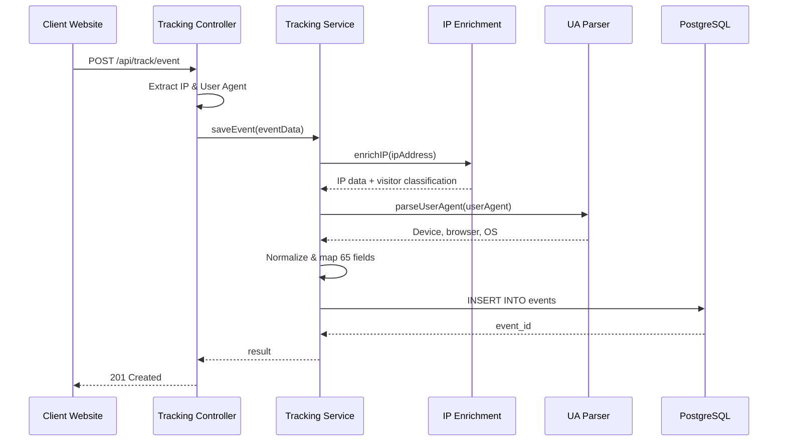

# Tracking Service Guide

**Version:** 1.0.0  
**Last Updated:** November 7, 2025

## Overview

The Beacon tracking service is now fully functional with complete support for all 65 data points, automatic IP enrichment, and user agent parsing.

---

## ✅ What's Implemented

### 1. Enhanced Tracking Service

**File:** `src/services/trackingService.js`

#### Features:
- **Automatic IP Enrichment**: Every event is enriched with IPinfo.io data
- **User Agent Parsing**: Extracts device type, browser, and OS
- **Complete Field Mapping**: All 65 data points mapped to database schema
- **Flexible Input**: Accepts fields in properties object or top-level
- **Transaction Support**: Batch events use database transactions
- **Comprehensive JSDoc**: Full documentation for all functions

#### Key Functions:

```javascript
// Save single event with enrichment
await saveEvent({
  event: 'page_view',
  sessionId: 'session-123',
  ipAddress: '8.8.8.8',
  userAgent: 'Mozilla/5.0...',
  properties: {
    page_url: 'https://example.com',
    utm_source: 'google'
  }
});

// Save batch events
await saveBatchEvents(events, ipAddress, userAgent);

// Query events
await getEventsByUser(userId, limit, offset);
await getEventsBySession(sessionId, limit, offset);
```

### 2. Enhanced Tracking Controller

**File:** `src/controllers/trackingController.js`

#### Features:
- **Proxy-Aware IP Extraction**: Checks `X-Forwarded-For` header
- **Flexible Field Names**: Supports both camelCase and snake_case
- **Comprehensive Field Support**: All event types (page views, e-commerce, leads)
- **Full JSDoc Documentation**: Every function documented

---

## 📊 Supported Data Points

### Complete 65-Point Coverage

| Category | Fields | Status |
|----------|--------|--------|
| User Identification | 7 fields | ✅ |
| Device & Browser | 10 fields | ✅ |
| Network & Location | 21 fields | ✅ |
| Page & Referral | 14 fields | ✅ |
| Engagement | 8 fields | ✅ |
| E-commerce & Leads | 2 fields (JSONB) | ✅ |
| Event Metadata | 5 fields | ✅ |
| **Total** | **65+ fields** | ✅ |

---

## 🚀 How It Works

### Event Processing Flow



### Data Enrichment

**1. IP Enrichment (Automatic)**
- Calls IPinfo.io API
- Caches results (7d business, 24h consumer)
- Extracts 21 location & company fields
- Classifies visitor type (business/consumer/bot/VPN)

**2. User Agent Parsing (Automatic)**
- Parses UA string with ua-parser-js
- Extracts device category (desktop/mobile/tablet)
- Identifies browser and version
- Detects operating system

**3. Field Mapping**
- Maps all 65 fields to database columns
- Handles flexible input (properties or top-level)
- Supports both naming conventions
- Converts timestamps to milliseconds

---

## 📝 Usage Examples

### Example 1: Simple Page View

```bash
curl -X POST http://localhost:3000/api/track/event \
  -H "Content-Type: application/json" \
  -d '{
    "event": "page_view",
    "sessionId": "session-123",
    "properties": {
      "page_url": "https://example.com/home",
      "page_title": "Home Page"
    }
  }'
```

**What happens:**
- IP extracted from request
- IP enriched with IPinfo.io → city, country, company
- User agent parsed → device, browser, OS
- All fields saved to database
- Returns event_id

### Example 2: E-commerce Purchase

```bash
curl -X POST http://localhost:3000/api/track/event \
  -H "Content-Type: application/json" \
  -d '{
    "event": "purchase",
    "userId": "user-456",
    "sessionId": "session-789",
    "properties": {
      "page_url": "https://shop.com/checkout",
      "utm_source": "facebook",
      "utm_campaign": "summer_sale"
    },
    "ecommerce": {
      "transaction_id": "order-123",
      "value": 99.99,
      "currency": "USD",
      "items": [
        {
          "item_id": "SKU123",
          "item_name": "Running Shoes",
          "price": 99.99,
          "quantity": 1
        }
      ]
    }
  }'
```

### Example 3: Lead Generation

```bash
curl -X POST http://localhost:3000/api/track/event \
  -H "Content-Type: application/json" \
  -d '{
    "event": "generate_lead",
    "sessionId": "session-abc",
    "emailHash": "abc123...",
    "properties": {
      "utm_source": "linkedin",
      "page_url": "https://site.com/contact"
    },
    "lead": {
      "form_id": "contact-form",
      "lead_type": "demo_request",
      "lead_value": 500
    }
  }'
```

### Example 4: Batch Events

```bash
curl -X POST http://localhost:3000/api/track/batch \
  -H "Content-Type: application/json" \
  -d '{
    "events": [
      {
        "event": "page_view",
        "sessionId": "session-123",
        "properties": { "page_url": "/page1" }
      },
      {
        "event": "button_click",
        "sessionId": "session-123",
        "properties": { "button_id": "cta-main" }
      },
      {
        "event": "scroll",
        "sessionId": "session-123",
        "properties": { "scroll_depth_percent": 75 }
      }
    ]
  }'
```

---

## 🔍 Verifying Data

### Check Database

```sql
-- Connect to PostgreSQL
psql -U postgres -d beacon

-- View recent events with enrichment
SELECT 
  event_name,
  visitor_type,
  ip_company_name,
  ip_city,
  ip_country,
  device_category,
  browser,
  utm_source,
  server_timestamp
FROM events 
ORDER BY server_timestamp DESC 
LIMIT 10;

-- Check business visitor tracking
SELECT 
  ip_company_name,
  ip_company_domain,
  COUNT(*) as event_count,
  MAX(server_timestamp) as last_seen
FROM events
WHERE visitor_type = 'business'
GROUP BY ip_company_name, ip_company_domain
ORDER BY event_count DESC
LIMIT 10;
```

### Check Redis Cache

```bash
# Connect to Redis CLI
redis-cli

# View cached IPs
KEYS ip_enrichment:*

# Check specific IP enrichment
GET ip_enrichment:8.8.8.8

# Check cache stats
INFO stats
```

---

## 🎯 Next Steps

Now that tracking is fully functional:

1. **Build JavaScript Tracking Script** - Client-side data collection
2. **Add Site Management** - Multi-tenant site configuration
3. **Implement Authentication** - Secure API access
4. **Build Company Insights** - B2B visitor analytics
5. **Create Analytics APIs** - Metrics and reporting

---

## 📚 Related Documentation

- [System Architecture](../architecture/system-architecture.md)
- [Database Schema](../../config/schema.sql)
- [IP Enrichment Service](../../src/services/ipEnrichmentService.js)
- [User Agent Parser](../../src/utils/userAgentParser.js)
- [API Tests](../../tests/trackingService.test.js)

---

## 🐛 Troubleshooting

### Events Not Saving

**Check:**
1. PostgreSQL is running
2. Database migrations ran successfully
3. Check server logs for errors

### IP Enrichment Not Working

**Check:**
1. IPINFO_API_KEY is set in `.env`
2. Redis is running (for caching)
3. Test API key: `curl "https://ipinfo.io/8.8.8.8?token=YOUR_KEY"`

### User Agent Not Parsed

**Check:**
1. `user-agent` header is present in request
2. ua-parser-js dependency is installed
3. Check console logs for parsing errors

---

**Document Version:** 1.0.0  
**Last Updated:** November 7, 2025
